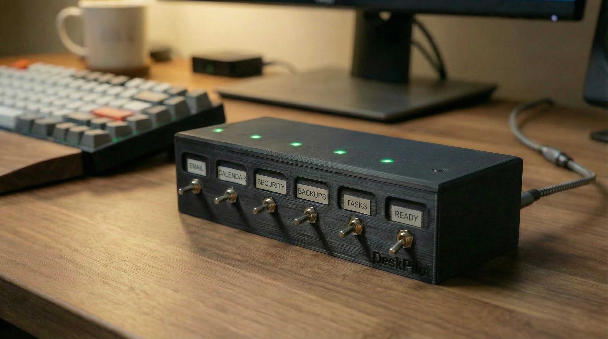
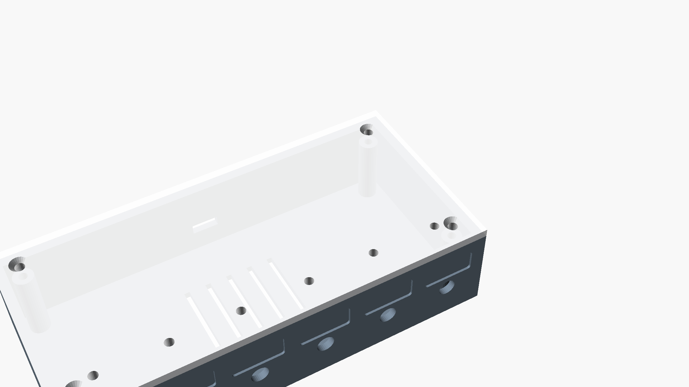

# 3D Printer DeskPilot

A physical toggle-switch checklist box with LED indicators -- inspired by aviation pre-flight "DeskPilot" checklists, adapted for daily office/maker workflows.

**No microcontroller needed!** Pure simple wiring: each toggle switch directly controls an LED through a resistor. Plug in USB-C for power, flip toggles, LEDs light up. That's it.

 



*OpenSCAD render:*



## Three Versions

| Version | Dimensions | Toggles | Labels | Min Build Plate |
|---------|-----------|---------|--------|----------------|
| **V1** | 171.5 x 76.2 x 38.1mm | 8 | Cut-through text | 200mm+ |
| **V2** | 171.5 x 76.2 x 38.1mm | 8 | Stick-in label slots | 200mm+ |
| **V3** (Recommended) | 145 x 70 x 35mm | 6 | Stick-in label slots | **150mm** (Adventurer 3) |

## Features

- **Simple wiring** -- no code, no microcontroller, no programming
- **USB-C powered** -- any phone charger works (draws only 160mA)
- **Swappable labels** (V2/V3) -- recessed slots for stick-in paper labels
- **LED indicators** -- green LEDs on top lid, one per toggle
- **Optional USB hub** -- add USB-A ports for charging devices
- **3D printable** -- OpenSCAD source files included

## Quick Start

1. **Print** the bottom + lid STL files for your version
2. **Buy** components from the [BOM](BOM_DeskPilot.md) (~$51-83)
3. **Wire** toggles -> resistors -> LEDs (see wiring diagram in BOM)
4. **Print labels** using `label_template.html` and stick them in

## Files

### STL Files (Ready to Print)
| File | Description |
|------|-------------|
| `deskpilot_v3_bottom.stl` | V3 compact bottom (6 toggles, fits Adventurer 3) |
| `deskpilot_v3_lid.stl` | V3 compact lid |
| `deskpilot_v2_bottom.stl` | V2 full-size bottom (8 toggles) |
| `deskpilot_v2_lid.stl` | V2 full-size lid |

### Source & Templates
| File | Description |
|------|-------------|
| `deskpilot_box_v3_compact.scad` | V3 OpenSCAD source |
| `deskpilot_box_v2_labels.scad` | V2 OpenSCAD source |
| `deskpilot_box.scad` | V1 OpenSCAD source (cut-through text) |
| `generate_stl.py` | CadQuery Python STL generator |
| `label_template.html` | Printable label template (editable, 6/8 toggle selector) |
| `BOM_DeskPilot.md` | Full Bill of Materials with wiring diagram |

## Wiring

```
USB-C --> Breakout Board
              |
              +-- 5V --+-- Toggle 1 -- 150R -- LED 1 --+
              |        +-- Toggle 2 -- 150R -- LED 2 --+
              |        +-- Toggle 3 -- 150R -- LED 3 --+
              |        +-- Toggle 4 -- 150R -- LED 4 --+
              |        +-- Toggle 5 -- 150R -- LED 5 --+
              |        +-- Toggle 6 -- 150R -- LED 6 --+
              |                                         |
              +-- GND ----------------------------------+
```

## Print Settings

- **Nozzle:** 0.4mm
- **Layer Height:** 0.2mm
- **Infill:** 20-30%
- **Material:** PLA or PETG
- **Supports:** Not needed for bottom, may need for lid overhangs
- **Time:** ~4-6 hours total

## Estimated Cost

| Build | Cost |
|-------|------|
| Basic (power only) | $51-83 |
| With USB hub | $60-99 |

## Inspiration

Inspired by the [Missionary Bush Pilot BuddyCheck](https://www.missionarybushpilot.com/buddycheck) -- a physical pre-flight checklist used in aviation.

## License

MIT -- feel free to remix, modify, and share!
